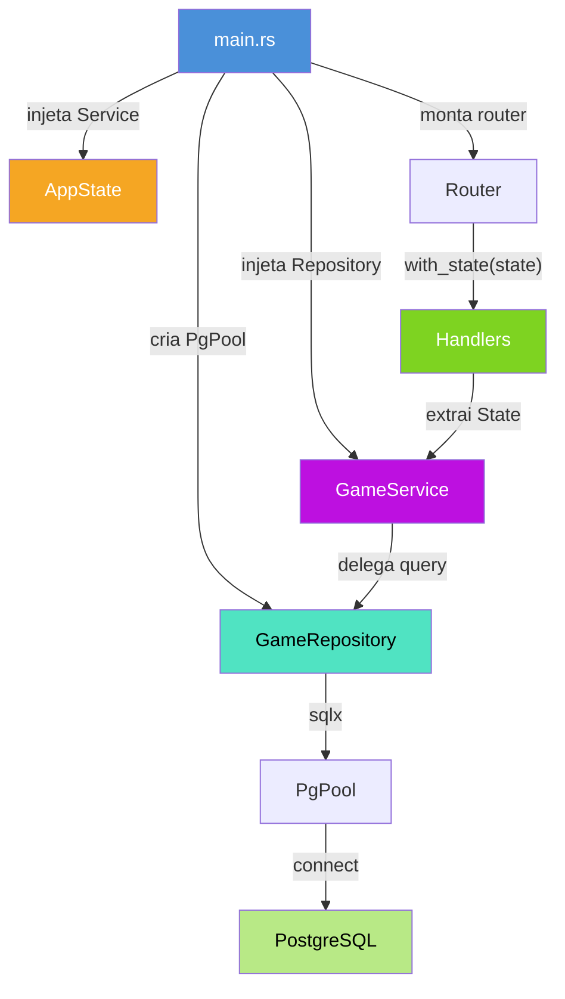
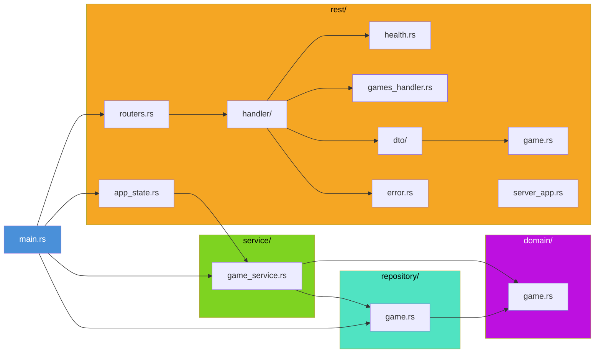
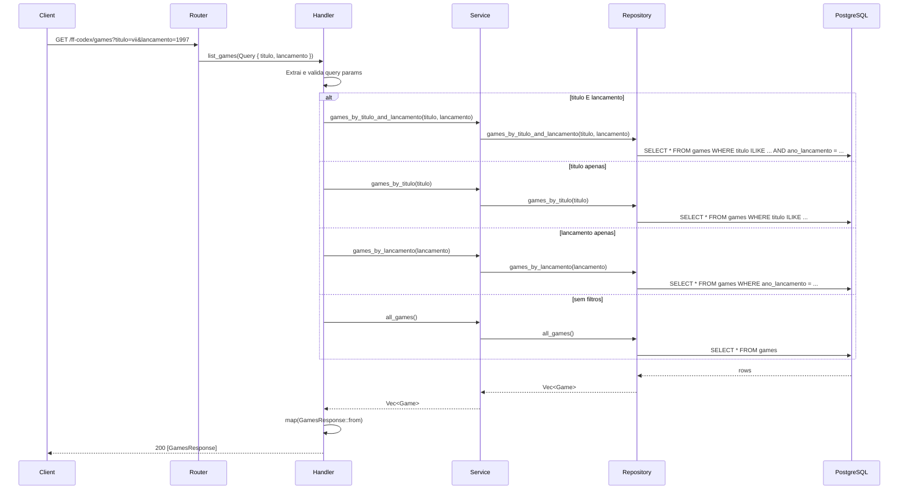
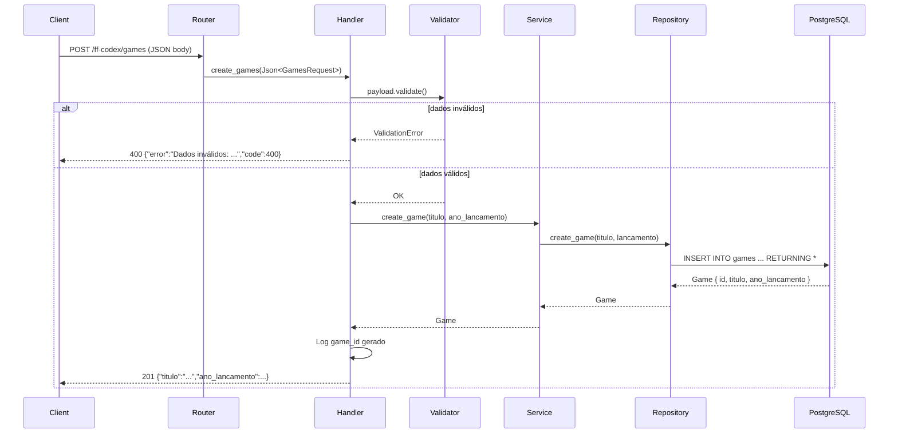
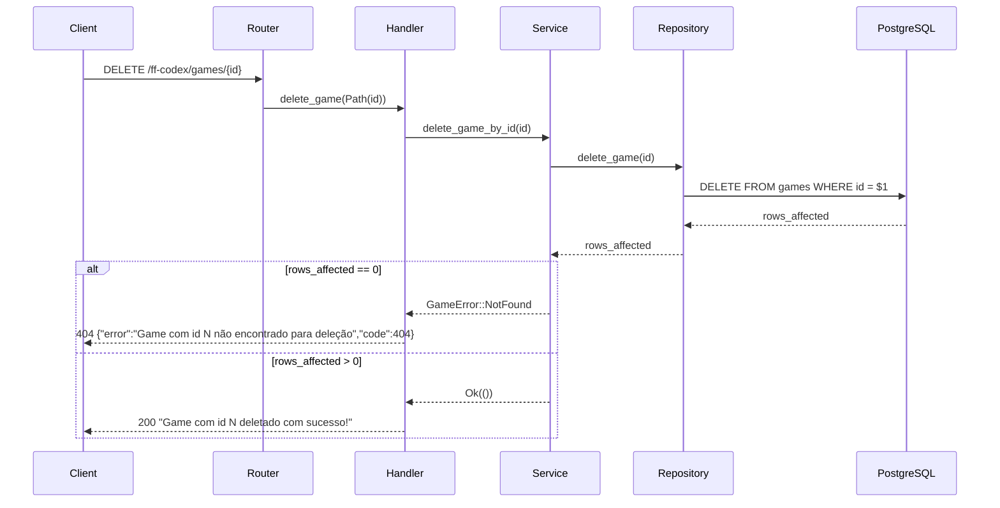
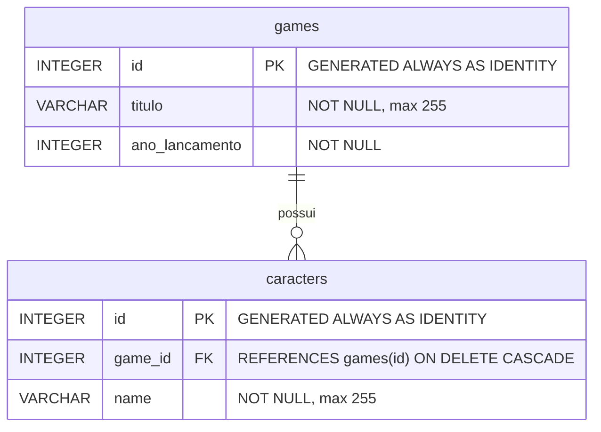

# FF Codex

Projeto de estudos para aprender **Rust**, **Axum** e **SQLx** por meio do desenvolvimento de uma API inspirada no universo de *Final Fantasy*.

O objetivo não é construir um produto completo, mas sim praticar conceitos fundamentais da linguagem e do ecossistema Rust enquanto se constrói algo divertido e com escopo bem definido.

## Stack

| Tecnologia | Papel | Status |
|------------|-------|--------|
| [Rust](https://www.rust-lang.org/) | Linguagem principal | Implementado (edition 2024) |
| [Axum](https://github.com/tokio-rs/axum) | Framework web (HTTP) | Implementado (rotas `/health`, `/ready` e CRUD `/ff-codex/games`) |
| [SQLx](https://github.com/launchbadge/sqlx) | Acesso a banco de dados | Implementado (leitura e escrita via `PgPool`) |
| [PostgreSQL](https://www.postgresql.org/) | Banco relacional | Efêmero via Docker Compose |
| [tracing](https://github.com/tokio-rs/tracing) | Observabilidade (logs estruturados JSON) | Implementado |
| [validator](https://github.com/Keats/validator) | Validação de payload de entrada | Implementado no `POST` |

> **Atenção:** o SQLx está integrado ao fluxo de leitura e escrita: `GET /ff-codex/games` consulta a tabela `games` via `State` + `GameService` (`GameRepository`), com filtros opcionais `?titulo=...` (busca parcial case-insensitive via `ILIKE`) e `?lancamento=...` (igualdade); `POST /ff-codex/games` persiste o cadastro no banco via `INSERT ... RETURNING *`; `GET /ff-codex/games/{id}` busca por id; `DELETE /ff-codex/games/{id}` remove por id.

## Status

O projeto está em **estágio de CRUD funcional para a entidade `games`**:

- `Cargo.toml` configurado com `edition = "2024"` e package `ff-codex`.
- Servidor HTTP com Axum 0.8 em `src/rest/` — rotas `/health`, `/ready` e CRUD `/ff-codex/games`.
- Logs estruturados em JSON via `tracing`/`tracing-subscriber`.
- Banco de dados PostgreSQL configurado via `docker-compose.yml` (container efêmero, exposto na porta 5432 do host).
- Migrações SQLx em `app/migrations/` (`001_create_table_game.sql`, `002_insert_game.sql` e `003_create_table_caracters.sql`).
- SQLx integrado: `.env` via `dotenvy`, `PgPool` (feature `postgres`) criado no `main.rs` e exposto via `State` (`GameService` → `GameRepository`).
- **Implementado:**
  - `GET /ff-codex/games` — lista do banco com filtros opcionais `titulo` (parcial, `ILIKE`) e `lancamento` (igualdade); sem filtros → lista completa; sem match → `200 []`.
  - `POST /ff-codex/games` — persiste o cadastro no banco (`INSERT ... RETURNING *`); payload validado por `validator` (`titulo` não vazio, `ano_lancamento > 0`); responde `201` ecoando o payload.
  - `GET /ff-codex/games/{id}` — busca um jogo por id; valida `id > 0` (`400`) e responde `404` quando não encontrado.
  - `DELETE /ff-codex/games/{id}` — remove um jogo por id; responde `404` quando não encontrado.
- Camadas separadas:
  - `domain/` — `Game` com `#[derive(FromRow, Debug)]`, campos `pub` (`id`, `titulo`, `ano_lancamento`).
  - `repository/` — `GameRepository { pool: PgPool }` com `all_games`, `games_by_titulo`, `games_by_lancamento`, `games_by_titulo_and_lancamento`, `games_by_id`, `create_game`, `delete_game`.
  - `service/` — `GameService` com `GameError` (`thiserror`: `NotFound`, `Internal(#[from] sqlx::Error)`); retorna **domínio**, nunca DTO.
  - `rest/` — `AppState` (`#[derive(Clone)]`), DTOs (`GamesRequest`, `GamesQuery`, `GamesResponse`, `GameDetailResponse`) com `impl From<Game>` para as respostas, `AppError` centralizado com `IntoResponse` (`NotFound`, `BadRequest`, `Internal`), `validator` aplicado no handler do `POST`.
- Erros centralizados em `src/rest/error.rs`: `AppError` mapeia para status HTTP (`404`, `400`, `500`) e corpo JSON `{ "error": "...", "code": <status> }`. `Internal` é logado via `tracing::error!`.

As próximas etapas completam o CRUD de `games` (PUT) e abrem espaço para as entidades temáticas do universo *Final Fantasy*.

## Arquitetura

### Camadas

A API segue uma arquitetura em camadas com separação clara de responsabilidades e injeção de dependências via `AppState`:



**Fluxo de dependências:**

| Camada | Responsabilidade | Arquivo(s) |
|--------|-----------------|------------|
| `main.rs` | Bootstrap: dotenv, tracing, PgPool, injeção | `src/main.rs` |
| `AppState` | Container de dependências (cloneável) | `src/rest/app_state.rs` |
| `Router` | Roteamento HTTP + extração de `State` | `src/rest/routers.rs` |
| `Handlers` | Traduz HTTP → domínio (DTO, status, AppError) | `src/rest/handler/` |
| `Service` | Regras de negócio, validação, orquestração | `src/service/game_service.rs` |
| `Repository` | SQL/persistência via SQLx | `src/repository/game.rs` |
| `Domain` | Structs de domínio (`Game`) | `src/domain/game.rs` |

### Módulos

Estrutura de módulos do código-fonte em `app/src/`:



## Fluxo de Requisições

### GET /ff-codex/games

Fluxo completo de uma requisição de listagem (com ou sem filtros):



### POST /ff-codex/games

Fluxo de criação com validação e persistência:



### DELETE /ff-codex/games/{id}

Fluxo de remoção com tratamento de não encontrado:



## Roadmap

Etapas planejadas para o aprendizado, em ordem sugerida:

1. **Servidor HTTP com Axum** ✅
   - Endpoint `GET /health` que retorna o status da API. ✅
   - Endpoint `GET /ready` (prontidão do serviço). ✅
   - Endpoint `GET/POST /ff-codex/games` (lista do banco com filtros; cadastro com persistência). ✅
   - Endpoint `GET/DELETE /ff-codex/games/{id}` (busca e remoção por id). ✅
   - Entender rotas, handlers, `State`, extração de parâmetros (`Path`, `Query`, `Json`) e `IntoResponse`. ✅

2. **Modelagem de dados** 🔄
   - Definir entidades do universo *Final Fantasy* (ex.: criaturas, personagens, itens). 🔄
   - Introduzir tipos e estruturas em Rust (DTOs `GamesRequest`/`GamesQuery`/`GamesResponse`/`GameDetailResponse` já criados). 🔄
   - Tabela `caracters` já existe (migração `003_create_table_caracters.sql`) aguardando camada Rust. 🔄

3. **Persistência com SQLx** ✅
   - Conectar ao PostgreSQL via Docker Compose (pool de conexões). ✅
   - Executar migrações e consultas reais no código (`GameRepository` cobrindo listagem, filtros, busca por id, inserção e remoção). ✅
   - Injeção via `State` (`GameService` + `AppState`). ✅
   - Filtrar a lista por título e/ou ano de lançamento via query params. ✅

4. **CRUD da API** 🔄
   - Criação, leitura, atualização e exclusão para `games`. 🔄
     - `POST /ff-codex/games` ✅
     - `GET /ff-codex/games` ✅
     - `GET /ff-codex/games/{id}` ✅
     - `DELETE /ff-codex/games/{id}` ✅
     - `PUT /ff-codex/games/{id}` (atualização) — pendente.
   - Praticar serialização com `serde` e validação com `validator`. ✅

5. **Funcionalidades temáticas (ideias)**
   - **Personagens**: camada Rust para a tabela `caracters` (CRUD + vínculo com `games` via `game_id`).
   - **Bestiário**: listar e consultar criaturas com atributos (HP, MP, fraquezas).
   - **Jobs**: catálogo de classes com habilidades.
   - **Itens**: inventário de itens consumíveis e equipamentos.
   - **Busca e filtros**: consultas por nome, tipo ou atributo em todas as entidades.

> As funcionalidades temáticas são ideias para guiar o aprendizado e podem mudar conforme o progresso.

## Como executar

### Pré-requisitos

- [Rust](https://www.rust-lang.org/tools/install) instalado (toolchain com suporte à `edition 2024`).
- `cargo` disponível no `PATH`.
- [Docker](https://docs.docker.com/get-docker/) e [Docker Compose](https://docs.docker.com/compose/) instalados.
- `sqlx-cli` instalado para executar as migrações:

  ```bash
  cargo install sqlx-cli --no-default-features --features native-tls,postgres
  ```

### Passos

Todos os comandos abaixo são executados a partir da pasta `app/`:

```bash
cd app

# 1. Subir o banco de dados (PostgreSQL via Docker Compose)
docker compose up -d

# 2. Executar as migrações (usa o DATABASE_URL definido no .env)
sqlx migrate run

# 3. Compilar o projeto
cargo build

# 4. Executar o binário
cargo run
```

Notas:

- O banco é **efêmero**: o `docker-compose.yml` não define volume persistente, então os dados são perdidos ao recriar o container (`docker compose down` seguido de `docker compose up -d`).
- O `DATABASE_URL` do `.env` aponta para `localhost:5432` (mesma porta mapeada pelo `docker-compose.yml`).
- **`cargo run` exige o banco de pé:** o `main.rs` conecta ao PostgreSQL no startup. Se o banco estiver parado ou o `DATABASE_URL` não estiver definido no `.env`, o programa loga o erro e encerra antes de subir o servidor.
- Para parar o banco: `docker compose down`.

A saída esperada ao executar `cargo run` é uma sequência de logs estruturados em JSON, por exemplo:

```json
{"timestamp":"...","level":"INFO","fields":{"message":"Iniciando a api de Final Fantasy."},"target":"ff_codex"}
{"timestamp":"...","level":"INFO","fields":{"message":"Server starting on http://0.0.0.0:8080"},"target":"ff_codex::rest::server_app"}
```

O servidor escuta por padrão em `0.0.0.0:8080` (configurável via variáveis de ambiente `HOST` e `PORT`, lidas em `src/rest/server_app.rs`) e responde a **graceful shutdown** em `Ctrl+C`/`SIGTERM`.

Para testar a API com o servidor de pé:

```bash
curl http://localhost:8080/health
curl http://localhost:8080/ready
curl http://localhost:8080/ff-codex/games
curl "http://localhost:8080/ff-codex/games?titulo=vii"
curl "http://localhost:8080/ff-codex/games?lancamento=1997"
curl "http://localhost:8080/ff-codex/games?titulo=final&lancamento=1997"
curl http://localhost:8080/ff-codex/games/1
curl -X DELETE http://localhost:8080/ff-codex/games/1
```

## Endpoints

| Método | Rota | Descrição | Resposta |
|--------|------|-----------|----------|
| GET | `/health` | Verificação de saúde da API | `200` `{"status":"up"}` |
| GET | `/ready` | Prontidão do serviço | `200` (sem corpo) |
| GET | `/ff-codex/games` | Lista de jogos do banco; aceita `?titulo=` (parcial case-insensitive via `ILIKE`) e/ou `?lancamento=` (igualdade) — sem filtros → lista completa; sem match → `200 []` | `200` `[{"titulo":"Final Fantasy VII","ano_lancamento":1997}]` |
| POST | `/ff-codex/games` | Cadastra um jogo (INSERT com `RETURNING *`); payload validado (`titulo` não vazio, `ano_lancamento > 0`); resposta ecoa o payload | `201` `{"titulo":"...","ano_lancamento":...}` |
| GET | `/ff-codex/games/{id}` | Busca um jogo por id (`id > 0`) | `200` `{"id":...,"titulo":"...","ano_lancamento":...}` ou `404` |
| DELETE | `/ff-codex/games/{id}` | Remove um jogo por id | `200` `"Game com id N deletado com sucesso!"` ou `404` |

> Os endpoints `/ff-codex/games` e `/ff-codex/games/{id}` leem e escrevem na tabela `games` via SQLx, com `AppError` centralizado retornando `{"error":"...","code":<status>}`.

### POST /ff-codex/games

Cadastra um novo jogo na tabela `games` (INSERT com `RETURNING *`). O `id` é gerado pelo banco (`GENERATED ALWAYS AS IDENTITY`) e usado apenas no log — a resposta ecoa o payload enviado. A validação de entrada é feita com `validator` (`#[derive(Validate)]` em `GamesRequest`).

**Request Body** (campos obrigatórios, validados):

```json
{
  "titulo": "Final Fantasy Tactics",
  "ano_lancamento": 1997
}
```

**Response (201):**

```json
{
  "titulo": "Final Fantasy Tactics",
  "ano_lancamento": 1997
}
```

**Erros:**

- `400 Bad Request` — payload inválido (campo ausente, `titulo` vazio ou `ano_lancamento <= 0`) via `AppError::BadRequest`. Corpo: `{"error":"Dados inválidos: <detalhes>","code":400}`.
- `500 Internal Server Error` — falha no banco de dados via `AppError::Internal` (logado com `tracing::error!`). Corpo: `{"error":"Erro interno do servidor","code":500}`.

Exemplo com `curl`:

```bash
curl -X POST http://localhost:8080/ff-codex/games \
  -H "Content-Type: application/json" \
  -d '{"titulo":"Final Fantasy Tactics","ano_lancamento":1997}'
```

### GET /ff-codex/games/{id}

Busca um jogo pelo `id` no banco. `id <= 0` é rejeitado com `400`. Quando o jogo não existe, responde `404` com `{"error":"Game com id N não encontrado","code":404}`.

Exemplo com `curl`:

```bash
curl http://localhost:8080/ff-codex/games/7
```

### DELETE /ff-codex/games/{id}

Remove um jogo pelo `id` no banco. Quando o jogo não existe, responde `404` com `{"error":"Game com id N não encontrado para deleção","code":404}`.

Exemplo com `curl`:

```bash
curl -X DELETE http://localhost:8080/ff-codex/games/7
```

## Estrutura do projeto

```
ff-codex/
├── app/
│   ├── Cargo.toml         # Manifesto do projeto (dependências e configuração)
│   ├── Cargo.lock         # Versões travadas das dependências
│   ├── Dockerfile         # Build multi-stage (rust:1.97 → distroless, porta 8080)
│   ├── docker-compose.yml # PostgreSQL efêmero para desenvolvimento
│   ├── .env               # Variáveis de ambiente (DATABASE_URL)
│   ├── migrations/        # Migrações SQLx
│   │   ├── 001_create_table_game.sql
│   │   ├── 002_insert_game.sql
│   │   └── 003_create_table_caracters.sql
│   └── src/
│       ├── main.rs        # Ponto de entrada (dotenv + tracing JSON + pool SQLx + router + server)
│       ├── rest.rs        # Módulo raiz da API (re-exports)
│       ├── rest/
│       │   ├── app_state.rs              # AppState (GameService) injetado via State
│       │   ├── dto.rs                    # Módulo raiz dos DTOs
│       │   ├── dto/game.rs               # DTOs (GamesRequest/Query/Response/DetailResponse) + validator + impl From<Game>
│       │   ├── error.rs                  # AppError + IntoResponse centralizado (404/400/500)
│       │   ├── handler.rs                # Módulo raiz dos handlers
│       │   ├── handler/health.rs         # GET /health e GET /ready
│       │   ├── handler/games_handler.rs  # GET lista (com filtros) / GET por id / POST / DELETE
│       │   ├── routers.rs                # Definição das rotas (+ with_state)
│       │   └── server_app.rs             # Bind + graceful shutdown (Ctrl+C/SIGTERM)
│       ├── domain.rs      # Módulo raiz de domínio
│       ├── domain/game.rs # Struct Game (FromRow, campos pub: id, titulo, ano_lancamento)
│       ├── repository.rs  # Módulo raiz de repositórios
│       ├── repository/game.rs # GameRepository (PgPool + all_games + games_by_titulo + games_by_lancamento + games_by_titulo_and_lancamento + games_by_id + create_game + delete_game)
│       ├── service.rs     # Módulo raiz de serviços
│       └── service/game_service.rs # GameService (GameError + all_games + games_by_titulo + games_by_lancamento + games_by_titulo_and_lancamento + game_by_id + create_game + delete_game_by_id)
├── .gitignore             # Arquivos ignorados pelo Git
├── LICENSE                # Licença MIT
└── README.md              # Este arquivo
```

O código-fonte fica em `app/` — todos os comandos (`cargo`, `sqlx`, `docker compose`) devem ser executados a partir dessa pasta. A estrutura será expandida conforme novas dependências e módulos forem adicionados (ex.: camada Rust para a tabela `caracters`).

## Schema do Banco

O banco PostgreSQL contém duas tabelas com relacionamento 1:N. A tabela `caracters` possui uma grafia incorreta ("characters") que é mantida por consistência com o histórico de migrações.



**Detalhes das tabelas:**

| Tabela | Coluna | Tipo | Constraints |
|--------|--------|------|-------------|
| `games` | `id` | `INTEGER` | PK, `GENERATED ALWAYS AS IDENTITY` |
| `games` | `titulo` | `VARCHAR(255)` | `NOT NULL` |
| `games` | `ano_lancamento` | `INTEGER` | `NOT NULL` |
| `caracters` | `id` | `INTEGER` | PK, `GENERATED ALWAYS AS IDENTITY` |
| `caracters` | `game_id` | `INTEGER` | FK → `games.id`, `ON DELETE CASCADE`, `NOT NULL` |
| `caracters` | `name` | `VARCHAR(255)` | `NOT NULL` |

**Relacionamento:** Um game pode ter vários caracters. Ao deletar um game, todos os caracters associados são removidos automaticamente (`ON DELETE CASCADE`).

