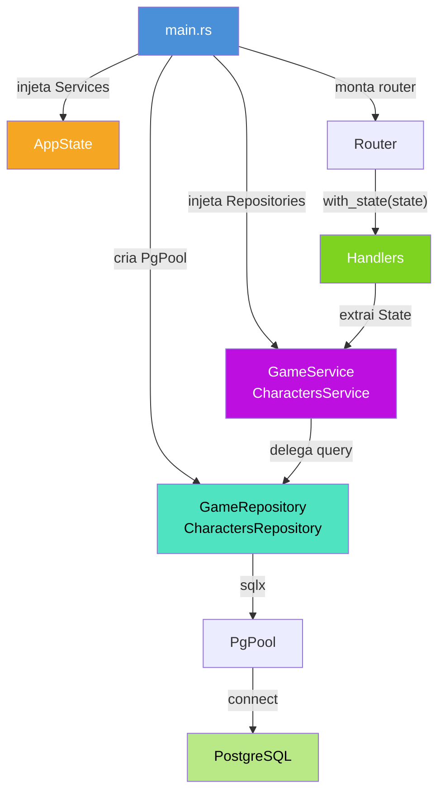
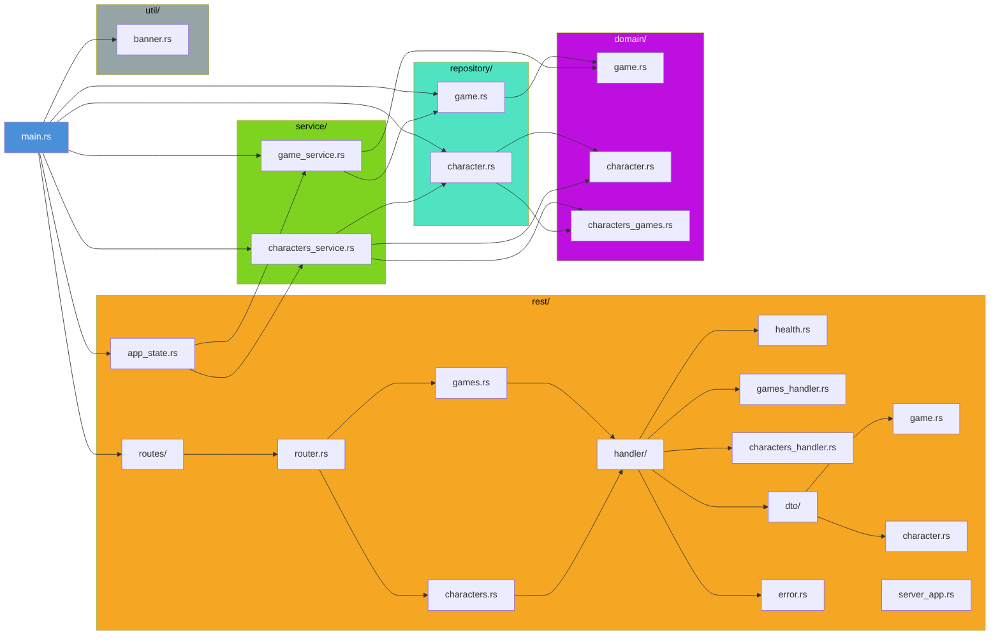
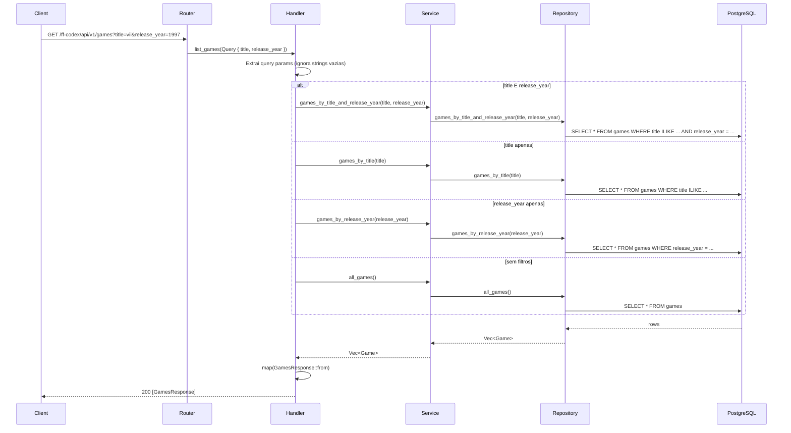
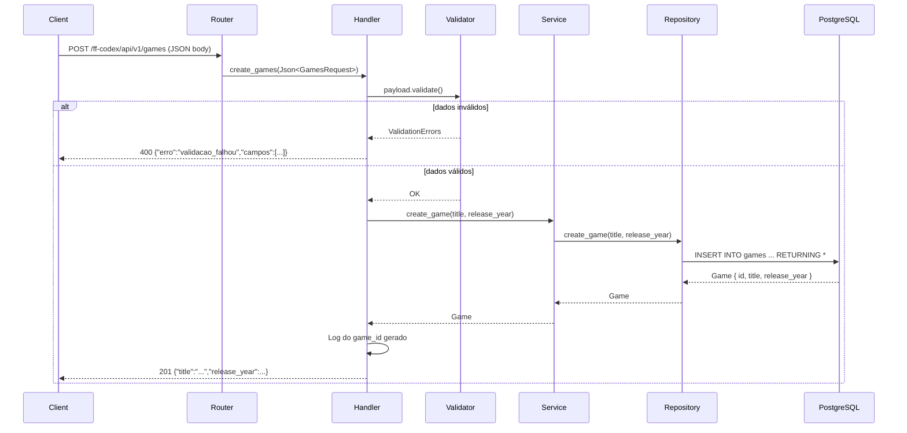
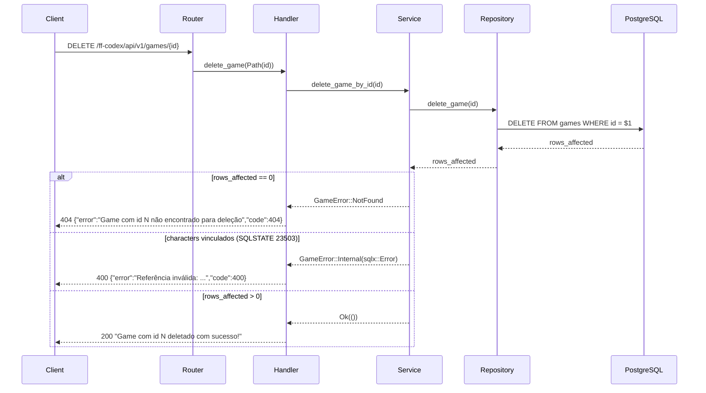
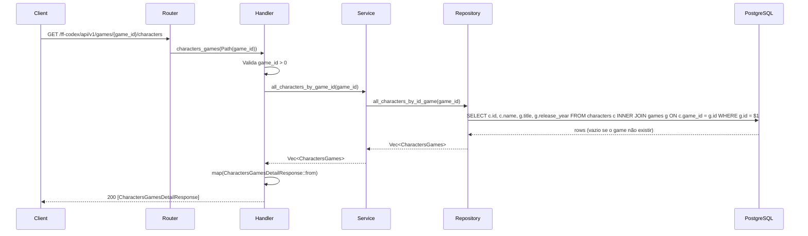
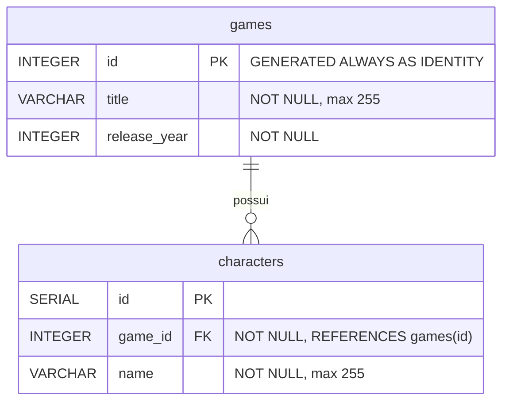

# FF Codex

Projeto de estudos para aprender **Rust**, **Axum** e **SQLx** por meio do desenvolvimento de uma API inspirada no universo de *Final Fantasy*.

O objetivo não é construir um produto completo, mas sim praticar conceitos fundamentais da linguagem e do ecossistema Rust enquanto se constrói algo divertido e com escopo bem definido.

## Stack

| Tecnologia | Papel |
|------------|-------|
| [Rust](https://www.rust-lang.org/) — edition 2024 | Linguagem principal |
| [Axum](https://github.com/tokio-rs/axum) 0.8 | Framework web (HTTP) |
| [Tokio](https://tokio.rs/) | Runtime assíncrono e graceful shutdown |
| [SQLx](https://github.com/launchbadge/sqlx) 0.8 | Acesso a banco de dados (PostgreSQL) com cache offline em `.sqlx/` |
| [PostgreSQL](https://www.postgresql.org/) 18 | Banco relacional, efêmero via Docker Compose |
| [Serde](https://serde.rs/) | Serialização e desserialização JSON |
| [validator](https://github.com/Keats/validator) 0.21 | Validação de payload de entrada |
| [thiserror](https://github.com/dtolnay/thiserror) | Erros de domínio tipados |
| [tracing](https://github.com/tokio-rs/tracing) | Observabilidade (logs estruturados em JSON) |
| [dotenvy](https://github.com/dotenv-rs/dotenvy) | Carregamento das variáveis do `.env` |

> **Nomenclatura:** o código, o schema e os contratos da API usam inglês (`title`, `release_year`, `name`, tabela `characters`), enquanto as mensagens de validação e os logs permanecem em português.

## Arquitetura

### Camadas

A API segue uma arquitetura em camadas com separação clara de responsabilidades e injeção de dependências via `AppState`:


```mermaid
graph TD
    main["main.rs"] -->|"cria PgPool"| Repo["GameRepository\nCharactersRepository"]
    main -->|"injeta Repositories"| Service["GameService\nCharactersService"]
    main -->|"injeta Services"| State["AppState"]
    main -->|"monta router"| Router["Router"]

    Router -->|"with_state(state)"| Handler["Handlers"]
    Handler -->|"extrai State"| Service
    Service -->|"delega query"| Repo
    Repo -->|"sqlx"| PgPool["PgPool"]
    PgPool -->|"connect"| DB["PostgreSQL"]

    style main fill:#4a90d9,color:#fff
    style State fill:#f5a623,color:#fff
    style Handler fill:#7ed321,color:#fff
    style Service fill:#bd10e0,color:#fff
    style Repo fill:#50e3c2,color:#000
    style DB fill:#b8e986,color:#000
```

**Fluxo de dependências:**

| Camada | Responsabilidade | Arquivo(s) |
|--------|-----------------|------------|
| `main.rs` | Bootstrap: dotenv, tracing, PgPool, injeção | `src/main.rs` |
| `AppState` | Container de dependências (cloneável) com os dois services | `src/rest/app_state.rs` |
| `Router` | Roteamento HTTP, prefixo `/ff-codex/api/v1` e extração de `State` | `src/rest/routes/` |
| `Handlers` | Traduz HTTP → domínio (DTO, status, `AppError`) | `src/rest/handler/` |
| `Service` | Regras de negócio e orquestração; retorna **domínio**, nunca DTO | `src/service/` |
| `Repository` | SQL e persistência via SQLx | `src/repository/` |
| `Domain` | Structs de domínio (`Game`, `Character`, `CharactersGames`) | `src/domain/` |

### Métodos por camada

| Camada | Métodos |
|--------|---------|
| `GameRepository` | `all_games`, `games_by_title`, `games_by_release_year`, `games_by_title_and_release_year`, `games_by_id`, `create_game`, `delete_game` |
| `CharactersRepository` | `all_characters`, `characters_by_id`, `find_character_by_name`, `all_characters_by_id_game`, `create_character` |
| `GameService` | `all_games`, `games_by_title`, `games_by_release_year`, `games_by_title_and_release_year`, `game_by_id`, `create_game`, `delete_game_by_id` |
| `CharactersService` | `all_characters`, `character_by_id`, `find_character_by_name`, `all_characters_by_game_id`, `create_character` |

Erros de domínio: `GameError` (`NotFound`, `Internal(#[from] sqlx::Error)`) e `CharacterError` (`NotFound`, `Internal(#[from] sqlx::Error)`), ambos via `thiserror`.

### Módulos

Estrutura de módulos do código-fonte em `app/src/`:


```mermaid
graph LR
    subgraph rest["rest/"]
        routes["routes/"]
        router["router.rs"]
        routes_games["games.rs"]
        routes_chars["characters.rs"]
        handler["handler/"]
        handler_health["health.rs"]
        handler_games["games_handler.rs"]
        handler_chars["characters_handler.rs"]
        dto["dto/"]
        dto_game["game.rs"]
        dto_char["character.rs"]
        error["error.rs"]
        app_state["app_state.rs"]
        server["server_app.rs"]
    end

    subgraph domain["domain/"]
        game_d["game.rs"]
        char_d["character.rs"]
        cg_d["characters_games.rs"]
    end

    subgraph repository["repository/"]
        game_r["game.rs"]
        char_r["character.rs"]
    end

    subgraph service["service/"]
        game_s["game_service.rs"]
        char_s["characters_service.rs"]
    end

    subgraph util["util/"]
        banner["banner.rs"]
    end

    main["main.rs"] --> app_state
    main --> routes
    main --> game_r
    main --> char_r
    main --> game_s
    main --> char_s
    main --> banner
    app_state --> game_s
    app_state --> char_s
    routes --> router
    router --> routes_games
    router --> routes_chars
    routes_games --> handler
    routes_chars --> handler
    handler --> handler_health
    handler --> handler_games
    handler --> handler_chars
    handler --> dto
    dto --> dto_game
    dto --> dto_char
    handler --> error
    game_s --> game_r
    char_s --> char_r
    game_r --> game_d
    char_r --> char_d
    game_s --> game_d
    char_s --> char_d
    char_s --> cg_d
    char_r --> cg_d

    style main fill:#4a90d9,color:#fff
    style rest fill:#f5a623,color:#000
    style domain fill:#bd10e0,color:#fff
    style repository fill:#50e3c2,color:#000
    style service fill:#7ed321,color:#000
    style util fill:#95a5a6,color:#000
```

## Fluxo de Requisições

### GET /ff-codex/api/v1/games

Fluxo completo de uma requisição de listagem (com ou sem filtros):


```mermaid
sequenceDiagram
    participant C as Client
    participant R as Router
    participant H as Handler
    participant S as Service
    participant RE as Repository
    participant DB as PostgreSQL

    C->>R: GET /ff-codex/api/v1/games?title=vii&release_year=1997
    R->>H: list_games(Query { title, release_year })
    H->>H: Extrai query params (ignora strings vazias)

    alt title E release_year
        H->>S: games_by_title_and_release_year(title, release_year)
        S->>RE: games_by_title_and_release_year(title, release_year)
        RE->>DB: SELECT * FROM games WHERE title ILIKE ... AND release_year = ...
    else title apenas
        H->>S: games_by_title(title)
        S->>RE: games_by_title(title)
        RE->>DB: SELECT * FROM games WHERE title ILIKE ...
    else release_year apenas
        H->>S: games_by_release_year(release_year)
        S->>RE: games_by_release_year(release_year)
        RE->>DB: SELECT * FROM games WHERE release_year = ...
    else sem filtros
        H->>S: all_games()
        S->>RE: all_games()
        RE->>DB: SELECT * FROM games
    end

    DB-->>RE: rows
    RE-->>S: Vec<Game>
    S-->>H: Vec<Game>
    H->>H: map(GamesResponse::from)
    H-->>C: 200 [GamesResponse]
```

### POST /ff-codex/api/v1/games

Fluxo de criação com validação e persistência:


```mermaid
sequenceDiagram
    participant C as Client
    participant R as Router
    participant H as Handler
    participant V as Validator
    participant S as Service
    participant RE as Repository
    participant DB as PostgreSQL

    C->>R: POST /ff-codex/api/v1/games (JSON body)
    R->>H: create_games(Json<GamesRequest>)
    H->>V: payload.validate()
    alt dados inválidos
        V-->>H: ValidationErrors
        H-->>C: 400 {"erro":"validacao_falhou","campos":[...]}
    else dados válidos
        V-->>H: OK
        H->>S: create_game(title, release_year)
        S->>RE: create_game(title, release_year)
        RE->>DB: INSERT INTO games ... RETURNING *
        DB-->>RE: Game { id, title, release_year }
        RE-->>S: Game
        S-->>H: Game
        H->>H: Log do game_id gerado
        H-->>C: 201 {"title":"...","release_year":...}
    end
```

### DELETE /ff-codex/api/v1/games/{id}

Fluxo de remoção com tratamento de não encontrado e violação de FK:


```mermaid
sequenceDiagram
    participant C as Client
    participant R as Router
    participant H as Handler
    participant S as Service
    participant RE as Repository
    participant DB as PostgreSQL

    C->>R: DELETE /ff-codex/api/v1/games/{id}
    R->>H: delete_game(Path(id))
    H->>S: delete_game_by_id(id)
    S->>RE: delete_game(id)
    RE->>DB: DELETE FROM games WHERE id = $1
    DB-->>RE: rows_affected
    RE-->>S: rows_affected
    alt rows_affected == 0
        S-->>H: GameError::NotFound
        H-->>C: 404 {"error":"Game com id N não encontrado para deleção","code":404}
    else characters vinculados (SQLSTATE 23503)
        S-->>H: GameError::Internal(sqlx::Error)
        H-->>C: 400 {"error":"Referência inválida: ...","code":400}
    else rows_affected > 0
        S-->>H: Ok(())
        H-->>C: 200 "Game com id N deletado com sucesso!"
    end
```

### GET /ff-codex/api/v1/games/{game_id}/characters

Fluxo da listagem de personagens vinculados a um jogo:


```mermaid
sequenceDiagram
    participant C as Client
    participant R as Router
    participant H as Handler
    participant S as Service
    participant RE as Repository
    participant DB as PostgreSQL

    C->>R: GET /ff-codex/api/v1/games/{game_id}/characters
    R->>H: characters_games(Path(game_id))
    H->>H: Valida game_id > 0
    H->>S: all_characters_by_game_id(game_id)
    S->>RE: all_characters_by_id_game(game_id)
    RE->>DB: SELECT c.id, c.name, g.title, g.release_year FROM characters c INNER JOIN games g ON c.game_id = g.id WHERE g.id = $1
    DB-->>RE: rows (vazio se o game não existir)
    RE-->>S: Vec<CharactersGames>
    S-->>H: Vec<CharactersGames>
    H->>H: map(CharactersGamesDetailResponse::from)
    H-->>C: 200 [CharactersGamesDetailResponse]
```

## Como executar

### Pré-requisitos

- [Rust](https://www.rust-lang.org/tools/install) instalado (toolchain com suporte à `edition 2024`).
- `cargo` disponível no `PATH`.
- [Docker](https://docs.docker.com/get-docker/) e [Docker Compose](https://docs.docker.com/compose/) instalados.

### Passos

Todos os comandos abaixo são executados a partir da pasta `app/`:

```bash
cd app

# 1. Subir o banco, rodar as migrações e regenerar o cache .sqlx
#    (o compose já executa os serviços `migrate` e `prepare`)
docker compose up -d

# 2. Compilar o projeto
cargo build

# 3. Executar o binário
cargo run
```

Para instalar o `sqlx-cli` caso seja necessário rodar as migrações manualmente:

```bash
cargo install sqlx-cli --no-default-features --features postgres
sqlx migrate run    # usa o DATABASE_URL definido no .env
```

Notas:

- O `docker-compose.yml` define três serviços: `postgres` (banco), `migrate` (aplica as migrações assim que o healthcheck passa) e `prepare` (gera o cache `.sqlx/`). O passo `sqlx migrate run` manual é redundante quando o compose sobe normalmente.
- O cache em `.sqlx/` (12 queries) é o que permite `cargo check`/`cargo build` em modo offline (`SQLX_OFFLINE=true`, já configurado no Dockerfile e no CI). Se as queries mudarem, regenere com `cargo sqlx prepare`.
- O banco é **efêmero**: o serviço `postgres` não monta o volume `postgres_data` declarado no compose, então os dados são perdidos ao recriar o container (`docker compose down` seguido de `docker compose up -d`).
- O `DATABASE_URL` do `.env` aponta para `localhost:5432` (mesma porta mapeada pelo `docker-compose.yml`).
- **`cargo run` exige o banco de pé:** o `main.rs` conecta ao PostgreSQL no startup. Se o banco estiver parado ou o `DATABASE_URL` não estiver definido no `.env`, o programa loga o erro e encerra antes de subir o servidor.
- Para parar o banco: `docker compose down`.

Variáveis de ambiente reconhecidas:

| Variável | Default | Obrigatória |
|----------|---------|-------------|
| `DATABASE_URL` | — | Sim (erro fatal no startup se ausente) |
| `RUST_LOG` | `warn,ff_codex=trace` | Não |
| `HOST` | `0.0.0.0` | Não |
| `PORT` | `8080` | Não |

> O alvo do `EnvFilter` em `main.rs` é `ff_codex` (com underscore), porque o Cargo converte o nome do pacote `ff-codex` (com hífen) para o nome do binário. Escrever `ff-codex` faz o filtro não casar e os logs do crate somem.

A saída esperada ao executar `cargo run` é o banner `CODEx` seguido de uma sequência de logs estruturados em JSON, por exemplo:

```json
{"timestamp":"...","level":"INFO","fields":{"message":"Iniciando a api de Final Fantasy."},"target":"ff_codex"}
{"timestamp":"...","level":"INFO","fields":{"message":"Server starting on http://0.0.0.0:8080"},"target":"ff_codex::rest::server_app"}
```

O servidor escuta por padrão em `0.0.0.0:8080` e responde a **graceful shutdown** em `Ctrl+C`/`SIGTERM` (log `Desligamento gracioso concluído. Servidor encerrado.`).

Para testar a API com o servidor de pé:

```bash
curl http://localhost:8080/health
curl http://localhost:8080/ff-codex/api/v1/games
curl "http://localhost:8080/ff-codex/api/v1/games?title=vii"
curl "http://localhost:8080/ff-codex/api/v1/games?release_year=1997"
curl "http://localhost:8080/ff-codex/api/v1/games?title=final&release_year=1997"
curl http://localhost:8080/ff-codex/api/v1/games/1
curl -X DELETE http://localhost:8080/ff-codex/api/v1/games/1
curl http://localhost:8080/ff-codex/api/v1/characters
curl "http://localhost:8080/ff-codex/api/v1/characters?name=cloud"
curl http://localhost:8080/ff-codex/api/v1/characters/1
curl http://localhost:8080/ff-codex/api/v1/games/1/characters
```

## Endpoints

`GET /health` fica na raiz; todas as rotas de API são agrupadas sob o prefixo `/ff-codex/api/v1`.

| Método | Rota | Descrição | Sucesso | Erros |
|--------|------|-----------|---------|-------|
| GET | `/health` | Verificação de saúde da API | `200` `{"status":"up"}` | — |
| GET | `/ff-codex/api/v1/games` | Lista de jogos; filtros opcionais `?title=` (ILIKE parcial) e `?release_year=` (igualdade) | `200` `[{"title":"...","release_year":...}]` | `500` Erro interno |
| POST | `/ff-codex/api/v1/games` | Cadastra um jogo; payload validado | `201` `{"title":"...","release_year":...}` | `400` Validação estruturada, `500` Erro interno |
| GET | `/ff-codex/api/v1/games/{id}` | Busca um jogo por id | `200` `{"id":...,"title":"...","release_year":...}` | `400` Id inválido, `404` Não encontrado |
| DELETE | `/ff-codex/api/v1/games/{id}` | Remove um jogo por id | `200` `"Game com id N deletado com sucesso!"` | `400` FK violada, `404` Não encontrado, `500` Erro interno |
| GET | `/ff-codex/api/v1/characters` | Lista personagens; filtro opcional `?name=` (ILIKE parcial) | `200` `[{"name":"..."}]` | `500` Erro interno |
| GET | `/ff-codex/api/v1/characters/{id}` | Busca um personagem por id | `200` `{"id":...,"name":"...","game_id":...}` | `400` Id inválido, `404` Não encontrado |
| POST | `/ff-codex/api/v1/games/{game_id}/characters` | Cadastra um personagem vinculado a um jogo | `201` `{"name":"..."}` | `400` Validação estruturada, `409` Já existe, `500` Erro interno |
| GET | `/ff-codex/api/v1/games/{game_id}/characters` | Lista os personagens de um jogo (JOIN com `games`) | `200` `[{"id":...,"name":"...","title":"...","release_year":...}]` | `400` Id inválido, `500` Erro interno |

### Comportamentos observáveis

- **Filtro vazio é ignorado.** Os handlers aplicam `trim` e descartam strings vazias antes de filtrar; `?title=` (sem valor) equivale a não enviar filtro e retorna a lista completa. O mesmo vale para `?name=`.
- **`GET /characters?name=X` retorna no máximo um item.** `find_character_by_name` usa `fetch_optional`, então o filtro devolve 0 ou 1 registro, nunca uma lista.
- **`GET /games/{game_id}/characters` nunca retorna 404.** Um `game_id` inexistente resulta em `200 []`.
- **`GET /games/{id}` e `GET /characters/{id}` nunca retornam 500.** O handler converte qualquer erro em `NotFound`, inclusive falhas reais de banco.
- **Payload com campos em português é rejeitado.** Os DTOs esperam `title`/`release_year`; enviar `titulo`/`ano_lancamento` falha na desserialização e o Axum responde `422` com corpo em texto puro, não com o JSON de validação.

### Formatos de erro

Erros gerais usam chaves em inglês; erros de validação usam chaves em português:

```json
{ "error": "Game com id 999 não encontrado", "code": 404 }
```

```json
{
  "erro": "validacao_falhou",
  "campos": [
    { "campo": "title", "codigo": "titulo_vazio", "mensagem": "O título do jogo não pode ser vazio" }
  ]
}
```

`AppError` (`src/rest/error.rs`) centraliza as respostas via `IntoResponse`:

| Variante | Status | Corpo |
|----------|--------|-------|
| `NotFound(String)` | `404` | `{"error":"<msg>","code":404}` |
| `BadRequest(String)` | `400` | `{"error":"<msg>","code":400}` |
| `Validation(ValidationErrorResponse)` | `400` | `{"erro":"validacao_falhou","campos":[...]}` |
| `Conflict(String)` | `409` | `{"error":"<msg>","code":409}` |
| `Internal(anyhow::Error)` | `500` | `{"error":"Erro interno do servidor","code":500}` |

A variante `Internal` nunca expõe o erro original ao cliente — o detalhe vai apenas para o log via `tracing::error!`. Já `Conflict` e `BadRequest` por violação de restrição são gerados automaticamente pela conversão de `sqlx::Error`, que mapeia o SQLSTATE:

| SQLSTATE | Resultado | Mensagem fixa |
|----------|------------|---------------|
| `23505` (unique violation) | `409 Conflict` | `Já existe um registro com esses dados` |
| `23503` (foreign key violation) | `400 BadRequest` | `Referência inválida: o registro informado não existe` |
| demais | `500 Internal` | — |

### POST /ff-codex/api/v1/games

Cadastra um novo jogo na tabela `games` (`INSERT ... RETURNING *`). O `id` é gerado pelo banco (`GENERATED ALWAYS AS IDENTITY`) e usado apenas no log — a resposta ecoa o payload enviado. A validação de entrada é feita com `validator` (`#[derive(Validate)]` em `GamesRequest`).

**Request Body** (campos obrigatórios, validados):

```json
{
  "title": "Final Fantasy Tactics",
  "release_year": 1997
}
```

**Response (201):**

```json
{
  "title": "Final Fantasy Tactics",
  "release_year": 1997
}
```

**Erros:**

- `400 Bad Request` — payload inválido (`title` vazio ou `release_year <= 0`). Retorna JSON estruturado com detalhes por campo:
  ```json
  {
    "erro": "validacao_falhou",
    "campos": [
      { "campo": "title", "codigo": "titulo_vazio", "mensagem": "O título do jogo não pode ser vazio" },
      { "campo": "release_year", "codigo": "ano_invalido", "mensagem": "O ano de lançamento do jogo deve ser maior que 0" }
    ]
  }
  ```
- `500 Internal Server Error` — falha no banco de dados via `AppError::Internal` (logado com `tracing::error!`). Corpo: `{"error":"Erro interno do servidor","code":500}`.

**Exemplos com `curl`:**

Sucesso:

```bash
curl -X POST http://localhost:8080/ff-codex/api/v1/games \
  -H "Content-Type: application/json" \
  -d '{"title":"Final Fantasy Tactics","release_year":1997}'
```

Validação falhou:

```bash
curl -X POST http://localhost:8080/ff-codex/api/v1/games \
  -H "Content-Type: application/json" \
  -d '{"title":"","release_year":0}'
```

### GET /ff-codex/api/v1/games/{id}

Busca um jogo pelo `id` no banco.

**Response (200):**

```json
{
  "id": 1,
  "title": "Final Fantasy VII",
  "release_year": 1997
}
```

**Erros:**

- `400 Bad Request` — `id <= 0`. Corpo: `{"error":"O id do game não pode ser vazio ou menor que 1","code":400}`.
- `404 Not Found` — jogo não encontrado (também retornado em caso de falha no banco, por conversão do handler). Corpo: `{"error":"Game com id N não encontrado","code":404}`.

**Exemplos com `curl`:**

```bash
curl http://localhost:8080/ff-codex/api/v1/games/1   # sucesso
curl http://localhost:8080/ff-codex/api/v1/games/0   # id inválido
curl http://localhost:8080/ff-codex/api/v1/games/999 # não encontrado
```

### DELETE /ff-codex/api/v1/games/{id}

Remove um jogo pelo `id` no banco.

**Response (200):**

```
Game com id 1 deletado com sucesso!
```

> Nota: este endpoint retorna texto plano (`text/plain`), não JSON.

**Erros:**

- `400 Bad Request` — o jogo possui personagens vinculados. Como `characters.game_id` **não** tem `ON DELETE CASCADE`, a exclusão viola a FK (`SQLSTATE 23503`). Corpo: `{"error":"Referência inválida: o registro informado não existe","code":400}`.
- `404 Not Found` — jogo não encontrado. Corpo: `{"error":"Game com id N não encontrado para deleção","code":404}`.
- `500 Internal Server Error` — falha no banco. Corpo: `{"error":"Erro interno do servidor","code":500}`.

**Exemplos com `curl`:**

```bash
curl -X DELETE http://localhost:8080/ff-codex/api/v1/games/999  # não encontrado
```

### POST /ff-codex/api/v1/games/{game_id}/characters

Cadastra um personagem na tabela `characters`, vinculado ao jogo indicado no path. O vínculo **não** vai no body: `CharactersRequest` aceita apenas `name`.

**Request Body:**

```json
{
  "name": "Cloud Strife"
}
```

**Response (201):**

```json
{
  "name": "Cloud Strife"
}
```

**Erros:**

- `400 Bad Request` — `game_id <= 0` ou `name` vazio. A validação do `name` retorna o JSON estruturado:
  ```json
  {
    "erro": "validacao_falhou",
    "campos": [
      { "campo": "name", "codigo": "name_vazio", "mensagem": "O nome do personogem do jogo não pode ser vazio" }
    ]
  }
  ```
- `400 Bad Request` — `game_id` inexistente (violação de FK, `SQLSTATE 23503`).
- `409 Conflict` — o par `(game_id, name)` já existe (constraint `uk_character_game_name`, `SQLSTATE 23505`). Corpo: `{"error":"Já existe um registro com esses dados","code":409}`.
- `500 Internal Server Error` — falha no banco. Corpo: `{"error":"Erro interno do servidor","code":500}`.

> A mensagem de validação contém o typo `personogem`, presente no literal em `rest/dto/character.rs`.

**Exemplos com `curl`:**

Sucesso:

```bash
curl -X POST http://localhost:8080/ff-codex/api/v1/games/1/characters \
  -H "Content-Type: application/json" \
  -d '{"name":"Cloud Strife"}'
```

Nome duplicado no mesmo jogo:

```bash
curl -X POST http://localhost:8080/ff-codex/api/v1/games/1/characters \
  -H "Content-Type: application/json" \
  -d '{"name":"Cloud Strife"}'
```

### GET /ff-codex/api/v1/games/{game_id}/characters

Lista os personagens vinculados a um jogo, com o título e o ano do próprio jogo. Um `game_id` inexistente retorna `200 []`.

**Response (200):**

```json
[
  {
    "id": 1,
    "name": "Cloud Strife",
    "title": "Final Fantasy VII",
    "release_year": 1997
  }
]
```

**Erros:**

- `400 Bad Request` — `game_id <= 0`. Corpo: `{"error":"O id do game não pode ser vazio ou menor que 1","code":400}`.
- `500 Internal Server Error` — falha no banco. Corpo: `{"error":"Erro interno do servidor","code":500}`.

**Exemplos com `curl`:**

```bash
curl http://localhost:8080/ff-codex/api/v1/games/1/characters
```

## Tratamento de erros

Os handlers convertem `GameError` em `AppError` no limite HTTP. Pontos que valem registro:

- `delete_game_by_id` trata `GameError::NotFound` explicitamente para devolver `404` com a mensagem de deleção.
- Os demais caminhos passam pelo `From<sqlx::Error>`, que pode gerar `409`, `400` ou `500` conforme o SQLSTATE.
- `CharacterError` convém com o mesmo shape (`NotFound` / `Internal`) usado por `GameError`.

## Testes

O projeto **não possui testes automatizados**. Não há `#[cfg(test)]`, `#[test]` nem diretório `app/tests/`. O job `test` do CI (`.github/workflows/rust.yml`) executa `cargo test --all-features` e, por não haver testes, conclui sem exercitar nada.

O pipeline do CI roda três jobs em sequência: `check` (`cargo fmt --check` + `cargo clippy --all-targets --all-features` com `RUSTFLAGS: -Dwarnings`), `test` e `security` (`rustsec/audit-check@v2`). `SQLX_OFFLINE: true` é definido globalmente para que a compilação use o cache `.sqlx/`.

## Estrutura do projeto

```
ff-codex/
├── app/
│   ├── Cargo.toml         # Manifesto do projeto (dependências e configuração)
│   ├── Cargo.lock         # Versões travadas das dependências
│   ├── Dockerfile         # Build multi-stage (cargo-chef/rust 1.98 → distroless/cc, porta 8080, user nonroot)
│   ├── docker-compose.yml # PostgreSQL efêmero + serviços migrate e prepare
│   ├── .env               # DATABASE_URL
│   ├── .sqlx/             # Cache de queries para compilação offline (12 arquivos)
│   ├── migrations/        # Migrações SQLx
│   │   ├── 001_create_table_game.sql
│   │   ├── 002_insert_game.sql
│   │   ├── 003_create_table_characters.sql
│   │   └── 004_insert_characters.sql
│   └── src/
│       ├── main.rs        # Ponto de entrada (dotenv + tracing JSON + pool SQLx + router + server)
│       ├── util.rs        # Módulo raiz de utilitários
│       ├── util/
│       │   ├── banner.rs  # Impressão do banner no startup
│       │   └── banner.txt # ASCII art "CODEx"
│       ├── domain.rs      # Módulo raiz de domínio
│       ├── domain/
│       │   ├── game.rs              # Game { id, title, release_year }
│       │   ├── character.rs         # Character { id, name, game_id }
│       │   └── characters_games.rs  # Projeção do JOIN personagens × games
│       ├── repository.rs  # Módulo raiz de repositórios
│       ├── repository/
│       │   ├── game.rs     # GameRepository (7 queries)
│       │   └── character.rs # CharactersRepository (5 queries)
│       ├── service.rs     # Módulo raiz de serviços
│       ├── service/
│       │   ├── game_service.rs       # GameService + GameError
│       │   └── characters_service.rs # CharactersService + CharacterError
│       ├── rest.rs        # Módulo raiz da API (re-exports)
│       └── rest/
│           ├── app_state.rs              # AppState (GameService + CharactersService)
│           ├── error.rs                  # AppError + IntoResponse + mapeamento de SQLSTATE
│           ├── server_app.rs             # Bind + graceful shutdown (Ctrl+C/SIGTERM)
│           ├── routes.rs                 # Módulo raiz de rotas
│           ├── routes/
│           │   ├── router.rs             # /health + nest("/ff-codex/api/v1", ...) + with_state
│           │   ├── games.rs              # Rotas de games
│           │   └── characters.rs         # Rotas de characters
│           ├── handler.rs                # Módulo raiz dos handlers
│           ├── handler/
│           │   ├── health.rs             # GET /health
│           │   ├── games_handler.rs      # lista / por id / create / delete
│           │   └── characters_handler.rs # lista / por id / create / list por game
│           ├── dto.rs                    # Módulo raiz dos DTOs
│           └── dto/
│               ├── game.rs               # GamesRequest/Query/Response/GameDetailResponse
│               └── character.rs          # CharactersRequest/Query/Response/DetailResponse/GamesDetailResponse
├── .github/workflows/rust.yml # CI: fmt, clippy, test, rustsec
├── .gitignore             # Arquivos ignorados pelo Git
├── LICENSE                # Licença MIT
└── README.md              # Este arquivo
```

O código-fonte fica em `app/` — todos os comandos (`cargo`, `sqlx`, `docker compose`) devem ser executados a partir dessa pasta.

## Schema do Banco

O banco PostgreSQL contém duas tabelas com relacionamento 1:N. A tabela se chama `characters` (grafia correta em inglês).


```mermaid
erDiagram
    games {
        INTEGER id PK "GENERATED ALWAYS AS IDENTITY"
        VARCHAR title "NOT NULL, max 255"
        INTEGER release_year "NOT NULL"
    }

    characters {
        SERIAL id PK
        INTEGER game_id FK "NOT NULL, REFERENCES games(id)"
        VARCHAR name "NOT NULL, max 255"
    }

    games ||--o{ characters : "possui"
```

**Detalhes das tabelas:**

| Tabela | Coluna | Tipo | Constraints |
|--------|--------|------|-------------|
| `games` | `id` | `INTEGER` | PK, `GENERATED ALWAYS AS IDENTITY` |
| `games` | `title` | `VARCHAR(255)` | `NOT NULL` |
| `games` | `release_year` | `INTEGER` | `NOT NULL` |
| `characters` | `id` | `SERIAL` | PK |
| `characters` | `game_id` | `INTEGER` | FK → `games.id`, `NOT NULL` |
| `characters` | `name` | `VARCHAR(255)` | `NOT NULL` |

**Constraints adicionais:** `UNIQUE (game_id, name)` em `characters` — impede o mesmo nome de personagem duplicado dentro do mesmo jogo, e é a origem do `409 Conflict` no `POST`.

**Relacionamento:** um game pode ter vários characters, e cada character pertence a exatamente um game. **Não há `ON DELETE CASCADE`**: ao deletar um game que possui personagens vinculados, a API responde `400 Bad Request` por violação de FK (`SQLSTATE 23503`).

**Dados de seed:** a migração `002_insert_game.sql` popula 16 jogos (de *Final Fantasy* em 1987 até *Final Fantasy XVI* em 2023) e a migração `004_insert_characters.sql` popula cerca de 145 personagens vinculados a esses jogos.
